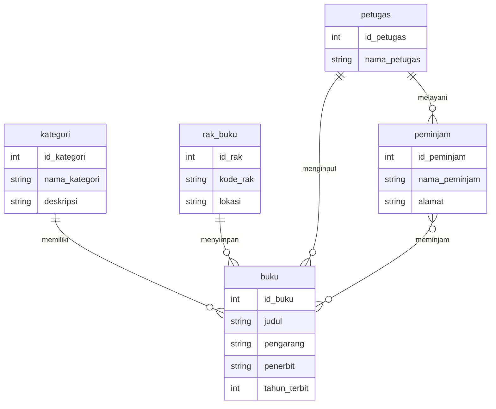

# ERD SISTEM PERPUSTAKAAN
Gambaran erd untuk sistem peminjaman buku di perpustakaan

## PREVIEW

```mermaid
erDiagram

buku{
    int id_buku
    string judul
    string pengarang
    string penerbit
    int tahun_terbit
}
    
kategori{
    int id_kategori
    string nama_kategori
    string deskripsi
}

rak_buku{
    int id_rak
    string kode_rak
    string lokasi
}

petugas{
    int id_petugas
    string nama_petugas
}

peminjam{
    int id_peminjam
    string nama_peminjam
    string alamat

}


kategori ||--o{ buku : "memiliki"
rak_buku ||--o{ buku : "menyimpan"
petugas ||--o{ buku : "menginput"
petugas ||--o{ peminjam : "melayani"
peminjam }o--o{ buku : "meminjam"
```